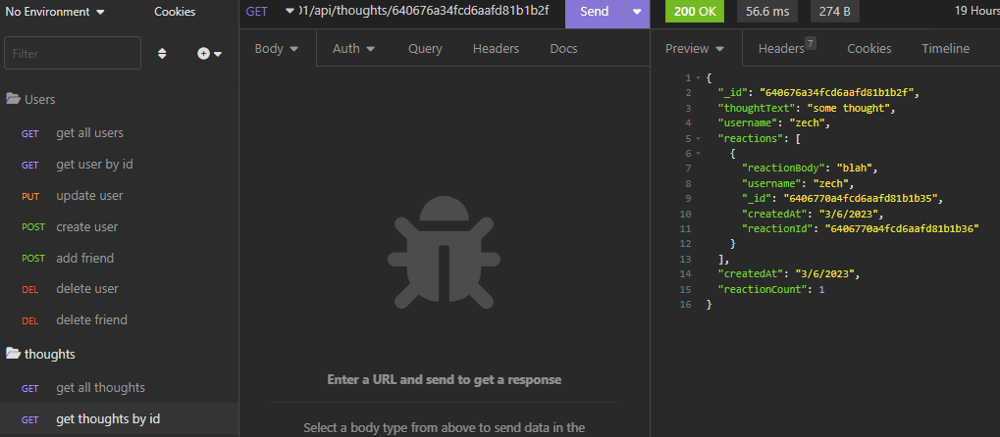

# Social Network API

## Description
This program is to simulate the routes of an social media application. It can get data as a collective or by id. The user can also create, update, and delete as well.

## Table of Contents
* [Installation](#installation)
* [Usage](#usage) 
* [License](#license)
* [Tests](#tests)
* [Questions](#questions)

## Installation
To install necessary dependencies, run the following command in the terminal using node.js:
install with npm i
Requires node.js, mongodb, and Insomnia installed on machine to run locally

## Usage 
Install dependencies then start server with "npm run start"\
See routes folder for routes and requirements to send request in insomnia

## License
This project is licensed under the MIT license.

## Tests
To run tests, run the following command:
NA

## Questions
Contact through email or Github

Email: zechariahbarrett@outlook.com

GitHub: [zechb7](https://github.com/zechb7) 